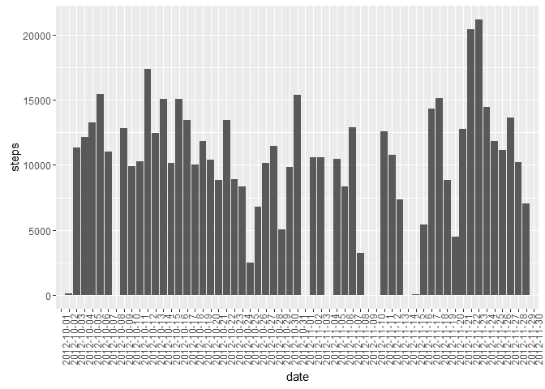
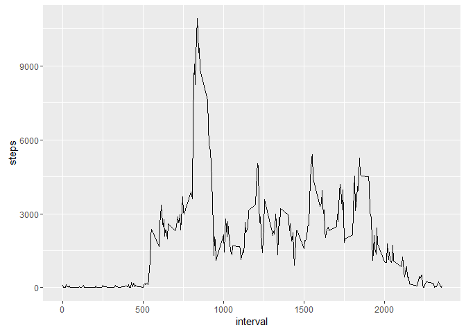
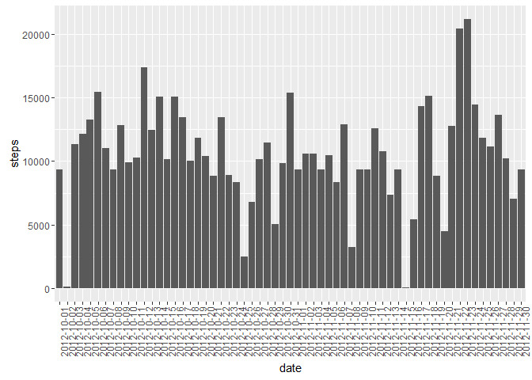
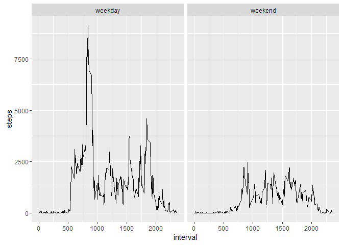

# Reproducible Research: Peer Assessment 1


## Loading and preprocessing the data


```r
  activity<-read.table("activity.csv", header = TRUE, sep = ",")
```


## What is mean total number of steps taken per day?


```r
  steps.daySum <- aggregate(activity$steps, by=list(date=activity$date), FUN=sum, na.rm = TRUE)
  names(steps.daySum)[names(steps.daySum) == "x"] = "steps"
  library(ggplot2)
```

```
## Warning: package 'ggplot2' was built under R version 3.1.3
```

```r
  g = ggplot(steps.daySum, aes(x = date, y = steps))+ geom_bar(stat = "identity") + theme(axis.text.x = element_text(angle = 90, hjust = 1))
  print(g)
```

<!-- -->

```r
  steps.dayMean <- aggregate(activity$steps, by=list(date=activity$date), FUN=mean, na.rm = TRUE)
  names(steps.dayMean)[names(steps.dayMean) == "x"] = "steps.daymean"
  
  steps.dayMedian <- aggregate(activity$steps, by=list(date=activity$date), FUN=median, na.rm = TRUE)
  names(steps.dayMedian)[names(steps.dayMedian) == "x"] = "steps.daymedian"
```
Bellow we see the mean per day.

```r
  steps.dayMean
```

```
##          date steps.daymean
## 1  2012-10-01           NaN
## 2  2012-10-02     0.4375000
## 3  2012-10-03    39.4166667
## 4  2012-10-04    42.0694444
## 5  2012-10-05    46.1597222
## 6  2012-10-06    53.5416667
## 7  2012-10-07    38.2465278
## 8  2012-10-08           NaN
## 9  2012-10-09    44.4826389
## 10 2012-10-10    34.3750000
## 11 2012-10-11    35.7777778
## 12 2012-10-12    60.3541667
## 13 2012-10-13    43.1458333
## 14 2012-10-14    52.4236111
## 15 2012-10-15    35.2048611
## 16 2012-10-16    52.3750000
## 17 2012-10-17    46.7083333
## 18 2012-10-18    34.9166667
## 19 2012-10-19    41.0729167
## 20 2012-10-20    36.0937500
## 21 2012-10-21    30.6284722
## 22 2012-10-22    46.7361111
## 23 2012-10-23    30.9652778
## 24 2012-10-24    29.0104167
## 25 2012-10-25     8.6527778
## 26 2012-10-26    23.5347222
## 27 2012-10-27    35.1354167
## 28 2012-10-28    39.7847222
## 29 2012-10-29    17.4236111
## 30 2012-10-30    34.0937500
## 31 2012-10-31    53.5208333
## 32 2012-11-01           NaN
## 33 2012-11-02    36.8055556
## 34 2012-11-03    36.7048611
## 35 2012-11-04           NaN
## 36 2012-11-05    36.2465278
## 37 2012-11-06    28.9375000
## 38 2012-11-07    44.7326389
## 39 2012-11-08    11.1770833
## 40 2012-11-09           NaN
## 41 2012-11-10           NaN
## 42 2012-11-11    43.7777778
## 43 2012-11-12    37.3784722
## 44 2012-11-13    25.4722222
## 45 2012-11-14           NaN
## 46 2012-11-15     0.1423611
## 47 2012-11-16    18.8923611
## 48 2012-11-17    49.7881944
## 49 2012-11-18    52.4652778
## 50 2012-11-19    30.6979167
## 51 2012-11-20    15.5277778
## 52 2012-11-21    44.3993056
## 53 2012-11-22    70.9270833
## 54 2012-11-23    73.5902778
## 55 2012-11-24    50.2708333
## 56 2012-11-25    41.0902778
## 57 2012-11-26    38.7569444
## 58 2012-11-27    47.3819444
## 59 2012-11-28    35.3576389
## 60 2012-11-29    24.4687500
## 61 2012-11-30           NaN
```

Bellow we see the median per day.

```r
  steps.dayMedian
```

```
##          date steps.daymedian
## 1  2012-10-01              NA
## 2  2012-10-02               0
## 3  2012-10-03               0
## 4  2012-10-04               0
## 5  2012-10-05               0
## 6  2012-10-06               0
## 7  2012-10-07               0
## 8  2012-10-08              NA
## 9  2012-10-09               0
## 10 2012-10-10               0
## 11 2012-10-11               0
## 12 2012-10-12               0
## 13 2012-10-13               0
## 14 2012-10-14               0
## 15 2012-10-15               0
## 16 2012-10-16               0
## 17 2012-10-17               0
## 18 2012-10-18               0
## 19 2012-10-19               0
## 20 2012-10-20               0
## 21 2012-10-21               0
## 22 2012-10-22               0
## 23 2012-10-23               0
## 24 2012-10-24               0
## 25 2012-10-25               0
## 26 2012-10-26               0
## 27 2012-10-27               0
## 28 2012-10-28               0
## 29 2012-10-29               0
## 30 2012-10-30               0
## 31 2012-10-31               0
## 32 2012-11-01              NA
## 33 2012-11-02               0
## 34 2012-11-03               0
## 35 2012-11-04              NA
## 36 2012-11-05               0
## 37 2012-11-06               0
## 38 2012-11-07               0
## 39 2012-11-08               0
## 40 2012-11-09              NA
## 41 2012-11-10              NA
## 42 2012-11-11               0
## 43 2012-11-12               0
## 44 2012-11-13               0
## 45 2012-11-14              NA
## 46 2012-11-15               0
## 47 2012-11-16               0
## 48 2012-11-17               0
## 49 2012-11-18               0
## 50 2012-11-19               0
## 51 2012-11-20               0
## 52 2012-11-21               0
## 53 2012-11-22               0
## 54 2012-11-23               0
## 55 2012-11-24               0
## 56 2012-11-25               0
## 57 2012-11-26               0
## 58 2012-11-27               0
## 59 2012-11-28               0
## 60 2012-11-29               0
## 61 2012-11-30              NA
```

## What is the average daily activity pattern?


```r
  steps.interval <- aggregate(activity$steps, by=list(interval=activity$interval), FUN=sum, na.rm = TRUE)
  names(steps.interval)[names(steps.interval) == "x"] = "steps"

  library(ggplot2)
  g = ggplot(steps.interval, aes(x = interval, y = steps))+ geom_line()
  print(g)
```

<!-- -->

```r
  maxIntervalSteps <- max(steps.interval$steps, na.rm = TRUE)
  maxInterval <- which(steps.interval$steps == max(steps.interval$steps), arr.ind = TRUE)
```

The inerval with the most steps recorded is:

```r
  steps.interval$interval[maxInterval]
```

```
## [1] 835
```

Bellow we see the steps of all the 5 minute intervals.

```r
  steps.interval
```

```
##     interval steps
## 1          0    91
## 2          5    18
## 3         10     7
## 4         15     8
## 5         20     4
## 6         25   111
## 7         30    28
## 8         35    46
## 9         40     0
## 10        45    78
## 11        50    16
## 12        55     7
## 13       100    17
## 14       105    36
## 15       110     8
## 16       115    18
## 17       120     0
## 18       125    59
## 19       130    97
## 20       135     9
## 21       140     9
## 22       145    20
## 23       150    14
## 24       155     0
## 25       200     0
## 26       205     0
## 27       210    60
## 28       215     0
## 29       220     0
## 30       225     7
## 31       230     0
## 32       235    12
## 33       240     0
## 34       245     0
## 35       250    82
## 36       255    50
## 37       300     0
## 38       305     0
## 39       310     0
## 40       315     0
## 41       320    11
## 42       325    33
## 43       330    86
## 44       335    31
## 45       340    26
## 46       345     4
## 47       350     0
## 48       355     0
## 49       400    63
## 50       405    50
## 51       410   136
## 52       415     0
## 53       420    18
## 54       425    19
## 55       430   218
## 56       435    35
## 57       440   185
## 58       445    44
## 59       450   165
## 60       455    59
## 61       500     0
## 62       505    83
## 63       510   159
## 64       515   119
## 65       520   176
## 66       525   157
## 67       530   111
## 68       535   321
## 69       540   849
## 70       545   972
## 71       550  2091
## 72       555  2358
## 73       600  1669
## 74       605  2611
## 75       610  2850
## 76       615  3363
## 77       620  2648
## 78       625  2495
## 79       630  2764
## 80       635  2085
## 81       640  2333
## 82       645  2341
## 83       650  1980
## 84       655  2599
## 85       700  2322
## 86       705  2352
## 87       710  2677
## 88       715  2889
## 89       720  2646
## 90       725  2702
## 91       730  2951
## 92       735  2349
## 93       740  2770
## 94       745  3686
## 95       750  3066
## 96       755  2976
## 97       800  3889
## 98       805  3615
## 99       810  6860
## 100      815  8349
## 101      820  9071
## 102      825  8236
## 103      830  9397
## 104      835 10927
## 105      840 10384
## 106      845  9517
## 107      850  9720
## 108      855  8852
## 109      900  7603
## 110      905  6574
## 111      910  5783
## 112      915  5730
## 113      920  5497
## 114      925  5086
## 115      930  3509
## 116      935  2397
## 117      940  1314
## 118      945  2054
## 119      950  1854
## 120      955  1116
## 121     1000  2150
## 122     1005  1430
## 123     1010  2248
## 124     1015  2791
## 125     1020  2063
## 126     1025  2692
## 127     1030  2347
## 128     1035  1983
## 129     1040  1839
## 130     1045  1502
## 131     1050  1330
## 132     1055  1693
## 133     1100  1662
## 134     1105  1573
## 135     1110  1130
## 136     1115  1354
## 137     1120  1504
## 138     1125  1403
## 139     1130  1772
## 140     1135  2649
## 141     1140  2228
## 142     1145  2364
## 143     1150  2440
## 144     1155  3137
## 145     1200  3385
## 146     1205  4648
## 147     1210  5027
## 148     1215  4917
## 149     1220  3360
## 150     1225  2659
## 151     1230  2887
## 152     1235  1718
## 153     1240  1406
## 154     1245  2000
## 155     1250  2388
## 156     1255  3566
## 157     1300  2244
## 158     1305  2114
## 159     1310  2293
## 160     1315  2172
## 161     1320  2451
## 162     1325  2991
## 163     1330  2266
## 164     1335  1332
## 165     1340  2118
## 166     1345  2838
## 167     1350  2508
## 168     1355  3223
## 169     1400  2955
## 170     1405  2754
## 171     1410  2310
## 172     1415  2581
## 173     1420  1880
## 174     1425  1990
## 175     1430  2218
## 176     1435  1458
## 177     1440   907
## 178     1445  1382
## 179     1450  2312
## 180     1455  2320
## 181     1500  1591
## 182     1505  1912
## 183     1510  1881
## 184     1515  2059
## 185     1520  2436
## 186     1525  2531
## 187     1530  2551
## 188     1535  3462
## 189     1540  4394
## 190     1545  5229
## 191     1550  5412
## 192     1555  4450
## 193     1600  3293
## 194     1605  3399
## 195     1610  3951
## 196     1615  3348
## 197     1620  3016
## 198     1625  3168
## 199     1630  2325
## 200     1635  2044
## 201     1640  2367
## 202     1645  2409
## 203     1650  2449
## 204     1655  2315
## 205     1700  2471
## 206     1705  2984
## 207     1710  2688
## 208     1715  3245
## 209     1720  3854
## 210     1725  4184
## 211     1730  3654
## 212     1735  3162
## 213     1740  3980
## 214     1745  2995
## 215     1750  1843
## 216     1755  1985
## 217     1800  2156
## 218     1805  3075
## 219     1810  3959
## 220     1815  4522
## 221     1820  3141
## 222     1825  3592
## 223     1830  4118
## 224     1835  3935
## 225     1840  4523
## 226     1845  5271
## 227     1850  4589
## 228     1855  4537
## 229     1900  4498
## 230     1905  4125
## 231     1910  3076
## 232     1915  2828
## 233     1920  1925
## 234     1925  1098
## 235     1930  1452
## 236     1935  2121
## 237     1940  1601
## 238     1945  1354
## 239     1950  2420
## 240     1955  1777
## 241     2000  1040
## 242     2005  1008
## 243     2010  1025
## 244     2015  1767
## 245     2020  1421
## 246     2025  1122
## 247     2030  1447
## 248     2035  1131
## 249     2040  1036
## 250     2045  1130
## 251     2050  1712
## 252     2055  1068
## 253     2100   845
## 254     2105   913
## 255     2110  1243
## 256     2115  1020
## 257     2120   660
## 258     2125   425
## 259     2130   777
## 260     2135   864
## 261     2140   460
## 262     2145   413
## 263     2150   431
## 264     2155   139
## 265     2200    77
## 266     2205   195
## 267     2210   255
## 268     2215   451
## 269     2220   375
## 270     2225   461
## 271     2230   517
## 272     2235   117
## 273     2240    17
## 274     2245     6
## 275     2250    85
## 276     2255   244
## 277     2300   175
## 278     2305   151
## 279     2310     0
## 280     2315    44
## 281     2320    51
## 282     2325    84
## 283     2330   138
## 284     2335   249
## 285     2340   175
## 286     2345    34
## 287     2350    12
## 288     2355    57
```

## Inputing missing values
  
The number of missing values is:

```r
  sum(is.na(activity$steps))
```

```
## [1] 2304
```

```r
  activity.full <- activity
  for (i in 1:nrow(activity.full)){
    if (is.na(activity.full$steps[i])){
      temp.int <- which(steps.interval$interval == activity.full$interval[i])
      activity.full$steps[i] <- steps.interval$steps[temp.int]/61
    }
  }
```
  
The number of missing values now is:

```r
  sum(is.na(activity.full$steps))
```

```
## [1] 0
```


```r
  steps.full.daySum <- aggregate(activity.full$steps, by=list(date=activity.full$date), FUN=sum, na.rm = TRUE)
  names(steps.full.daySum)[names(steps.full.daySum) == "x"] = "steps"
  g = ggplot(steps.full.daySum, aes(x = date, y = steps))+ geom_bar(stat = "identity") + theme(axis.text.x = element_text(angle = 90, hjust = 1))
  print(g)
```

<!-- -->
After adding the missing values the mean went up by about 15% and the median has some values where before it had everywhere zeros.


```r
  steps.full.dayMean <- aggregate(activity.full$steps, by=list(date=activity.full$date), FUN=mean, na.rm = TRUE)
  names(steps.full.dayMean)[names(steps.full.dayMean) == "x"] = "steps.full.daymean"
  
  steps.full.dayMedian <- aggregate(activity.full$steps, by=list(date=activity.full$date), FUN=median, na.rm = TRUE)
  names(steps.full.dayMedian)[names(steps.full.dayMedian) == "x"] = "steps.full.daymedian"
```
  
The number of missing values is:

```r
  sum(is.na(activity.full$steps))
```

```
## [1] 0
```

## Are there differences in activity patterns between weekdays and weekends?


```r
  activity$day <- weekdays(as.Date(activity$date, format='%Y-%m-%d'))
  for (i in 1:nrow(activity)){
    if (activity$day[i] == "Κυριακή" | activity$day[i] == "Σάββατο"){
      activity$day[i] = "weekend"
    }
    else{
      activity$day[i] = "weekday"
    }
  }
  
  steps.interval.day <- aggregate(activity$steps, by=list(interval=activity$interval, day=activity$day), FUN=sum, na.rm = TRUE)
  names(steps.interval.day)[names(steps.interval.day) == "x"] = "steps"
  
  ggplot(steps.interval.day, aes(x = interval, y = steps, group = day)) +
    geom_line() +
    facet_grid( ~ day)
```

<!-- -->
